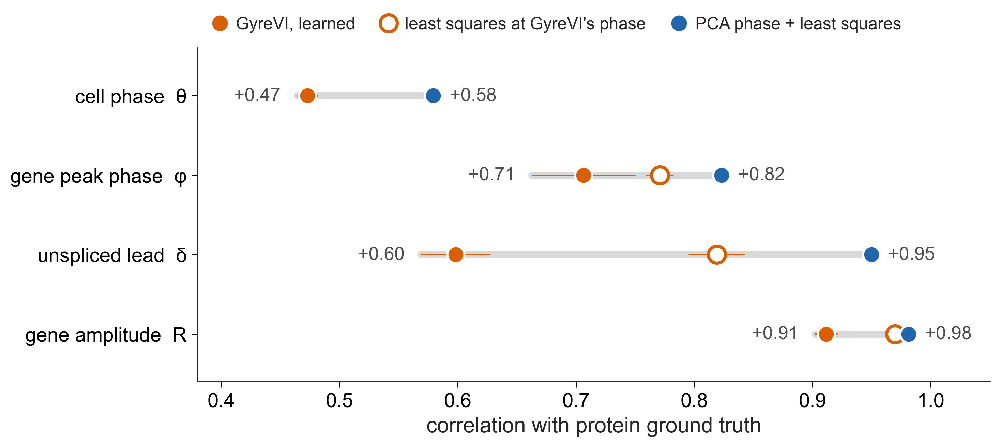
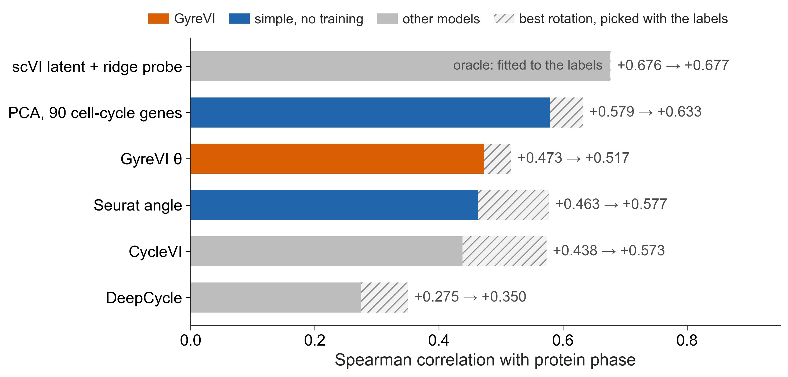
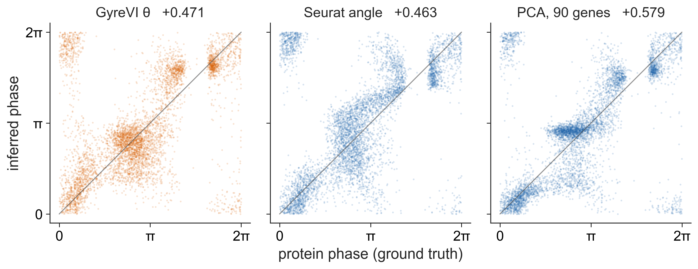
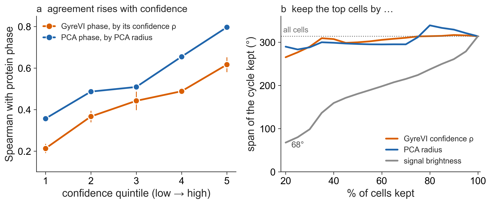

# GyreVI

**A deep generative model for a hidden cyclical state in noisy count data, benchmarked against strong simple baselines.**

GyreVI is a variational autoencoder. From ~2,000 sparse gene counts per cell, it places each of 5,422 cells
on a circle, its position in the cell cycle. For every gene, it estimates when the gene peaks and how far
its unspliced transcripts run ahead of the spliced ones. Every output is scored against an independent
protein measurement of each cell's position.

**Result: a simple linear baseline sets the bar, and shows how much signal is left to capture.** A phase
from PCA on 90 known cell-cycle genes, then a least-squares cosine fit per gene, leads on every quantity.

| correlation with ground truth | GyreVI, learned | least squares at GyreVI's phase | CycleVI phase + least squares | Seurat phase + least squares | PCA phase + least squares |
|---|---|---|---|---|---|
| cell phase θ | +0.473 ± 0.009 | — | +0.438 | +0.463 | **+0.579** |
| gene peak phase φ | +0.706 ± 0.044 | +0.771 ± 0.012 | +0.770 | +0.767 | **+0.823** |
| unspliced lead δ | +0.598 ± 0.029 | +0.819 ± 0.024 | +0.929 | +0.932 | **+0.950** |
| gene amplitude R | +0.912 ± 0.009 | +0.970 ± 0.003 | +0.966 | +0.963 | **+0.981** |

Spearman correlation after circular alignment, except φ (circular correlation). GyreVI: mean ± sd over 6
paired seeds. The last three columns reproduce with `python baselines/two_step.py`; the CycleVI column
needs CycleVI's output from `baselines/run_cyclevi.py` first.

The benchmark pinpoints two gaps:

- **Phase.** GyreVI is trained to follow the PCA phase as a reference, and ends up further from the truth
  than that reference (+0.473 vs +0.579).
- **Gene parameters.** Even at the model's own phase, least squares beats its learned parameters
  (δ: +0.82 vs +0.60).

**Why this is useful.** The PCA result shows the data hold more phase information than the model extracts
(+0.58; a supervised probe reaches +0.68), so the gap is in the model, not the data. The two gaps above
say where to look. A natural next step is to anchor the model at the PCA solution and learn only
corrections.

*Caveat:* the per-gene targets are themselves cosine fits at the protein phase, on the same counts, which
favours estimators of that form. Kinetics measured independently by metabolic labelling, which this
dataset supports, would be the cleaner test.

## Phase against published methods

Circular alignment for every method. The oracle is fitted to the labels: a ceiling, not a competitor.
GyreVI and the oracle: mean of 6 seeds. With the best of 144 rotations instead (chosen using the labels),
every method scores higher and the middle three change order; the PCA leads under both.

GyreVI: the seed closest to the 6-seed mean. The corners are the same point on the circle (0 = 2π).

## Confidence

**a** GyreVI's confidence ρ is calibrated: agreement rises steadily with it. The PCA's radius behaves the
same way, and sets the bar here too. **b** Filtering on either keeps most of the cycle. Filtering on signal
brightness keeps a 68° sliver, and agreement falls to zero, because brightness tracks the phase itself.

## Checks behind every number

- A simple estimator for every learned quantity, to set the target to beat.
- Paired seeds only: the GPU backend is non-deterministic.
- Range before correlation: a filter correlated with the target truncates it (panel b).
- An external reference for every internal check: a reversed phase frame once passed all of them.

## Repository

| | |
|---|---|
| `baselines/two_step.py` | the simple estimators above, from this repository alone |
| `circular.py` | circular statistics: alignment, circular correlation, resultant length |
| `prepare_battich.py` · `preprocess.py` · `gene_selection.py` · `_constants.py` | data preparation |
| `baselines/scvi_baseline.py` · `baselines/run_cyclevi.py` | the oracle, and CycleVI under matched conditions |

GyreVI's own code is not public; its numbers come from a 6-seed benchmark. Work done at Institut Curie.
Data: Battich et al., RPE1-FUCCI (public). License: MIT.
